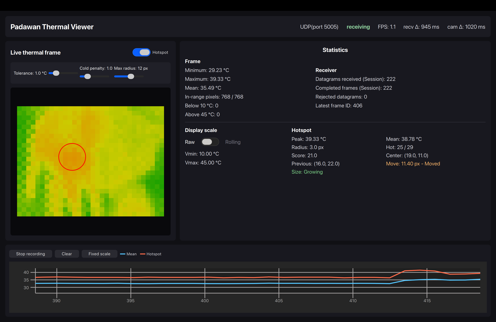
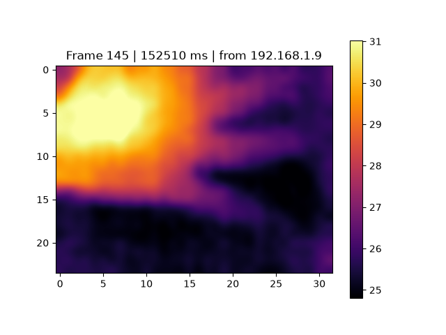
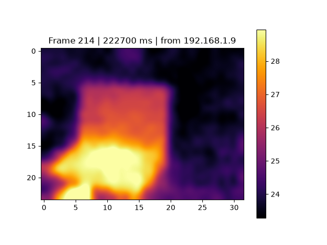

# **ESP32 Thermal Telemetry System**

An end-to-end embedded telemetry system built around an ESP32-S2 and an MLX90640 thermal camera.

The project demonstrates the complete acquisition, processing, transport, and visualization pipeline of thermal sensor data. Firmware running on the ESP32 acquires raw infrared measurements over I²C, calibrates and quantizes the thermal frame, packages it into a lightweight binary protocol, and streams it over Wi-Fi using UDP.

A companion Qt 6 desktop application automatically discovers the device, configures it through a TCP control channel, receives the telemetry stream, renders the thermal image in real time, and performs live statistics and hotspot analysis.

The project was designed as an exploration of embedded systems, firmware architecture, telemetry protocols, and desktop visualization rather than as a thermal camera application alone.

## Features

- ESP32-S2 firmware built with ESP-IDF and FreeRTOS
- MLX90640 thermal acquisition over I²C
- Factory calibration using the official Melexis API
- 8-bit configurable temperature quantization
- Custom binary telemetry protocol
- Automatic UDP device discovery
- Reliable TCP control channel
- Low-latency UDP thermal streaming
- Qt 6/QML desktop viewer
- Python receiver
- Real-time hotspot detection
- Rolling and fixed display scales
- Replay mode
- Live statistics and telemetry monitoring

## Hardware

| Component | Description |
|-----------|-------------|
| MCU | ESP32-S2 (Flipper Zero Wi-Fi Dev Board) |
| Sensor | MLX90640-D55 (24×32 infrared array) |
| Desktop | Qt 6 application or Python viewer |
```

## Firmware

- ESP-IDF

## Desktop Viewer

- Qt 6.8+
- Qt Quick
- Qt Network
- Qt Graphs

## Python Viewer

- Python 3.12+
- uv


[ESP-IDF installation](https://docs.espressif.com/projects/esp-idf/en/latest/esp32/get-started/)  
`https://docs.espressif.com/projects/esp-idf/en/latest/esp32/get-started/`


## Firmware Pipeline

A custom firmware was developed using the ESP-IDF framework.

The firmware:

- Configures the ESP32-S2 and MLX90640 over I²C (SDA on GPIO33, SCL on GPIO14).
- Periodically broadcasts an obfuscated UDP discovery packet, allowing compatible viewers to automatically detect the device.
- Reads and parses the sensor’s factory calibration EEPROM.
- Uses the official Melexis API to convert raw sensor data into calibrated object temperatures.
- Merges the two MLX90640 chessboard subpages into complete thermal frames.
- Quantizes the temperature data into a compact one-byte-per-pixel representation.
- Encapsulates each frame in a custom binary application protocol.
- Streams the resulting packets over Wi-Fi using UDP.
- Exposes a dedicated TCP control interface for runtime configuration (start/stop streaming, quantization mode, refresh rate, etc.).

The default quantization scheme is:
```
< 10°C      -> 0
10–45°C     -> 1–254
> 45°C      -> 255
```

This representation allows an entire 32 × 24 thermal frame (768 pixels), together with its protocol header, to fit comfortably within a single UDP datagram.

## C++ / Qt Viewer

The desktop viewer is implemented in modern C++ using Qt 6 and QML.

The application automatically discovers the device, receives and validates UDP datagrams, decodes the custom binary protocol, and renders the thermal image in real time. The networking layer is isolated from the presentation layer through a shared FrameModel, allowing protocol decoding, statistics computation, and QML rendering to evolve independently. It provides both rolling and fixed display scales, computes live frame statistics (minimum, maximum, mean, and valid pixel counts), performs lightweight hotspot detection, and displays real-time temperature plots for both the frame mean and the detected hotspot.

The viewer also communicates with the ESP32 through the TCP control channel, allowing runtime configuration of parameters such as the quantization mode, streaming state, and sensor refresh rate without interrupting the data stream.



## Python Viewer

The Python receiver reconstructs the temperature values and displays the thermal image using Matplotlib with bicubic interpolation.




# **Running**

Configure the Wi-Fi credentials in: 
```text
/main/wifi/wifi_sta.c
``` 

Build the firmware:
```text
idf.py build
```

Flash the board 
```text
idf.py -p /dev/cu.XXX flash monitor
```

Start the C++ / Qt viewer
The viewer requires Qt 6.8 or later with the Quick, Network, and
Graphs modules.
```bash
cd viewer
cmake -S . -B build
cmake --build build
./build/padawan_viewer
./build/padawan_viewer -h
```

Start python receiver
```text
cd receiver_python

uv sync
uv run stream.py
```

## Future Work
```text
- Adaptive color palettes and dynamic range visualization.
- Temporal filtering and noise reduction.
- Thermal motion detection on thermal time series.
- Higher frame rates.
- Export of recorded thermal sequences for offline analysis.
```
