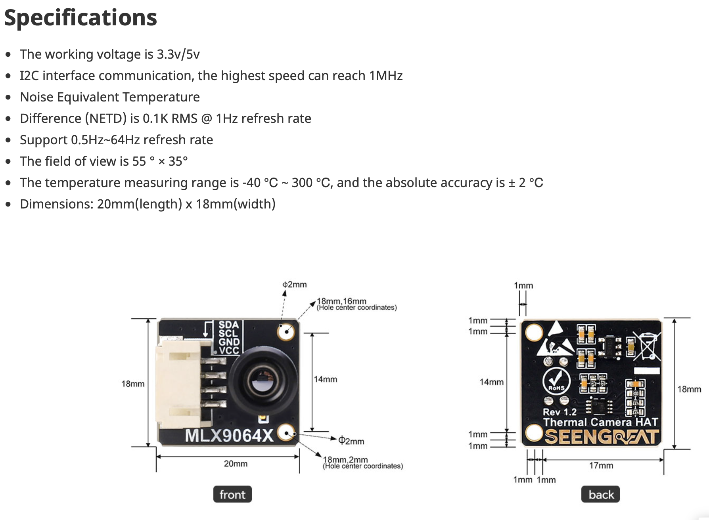

# Project Motivation

This project is intentionally small in scope but close to the hardware.

Unlike a desktop application, every design decision is constrained by CPU, memory, bus bandwidth, timing, and packet size...

# The Actual Idea

This is probably the 101 of embedded systems, but not in the sense of a toy hello-world program.

It is “hello world” under physical constraints.

The system has a small CPU, limited memory, a sensor with fixed timing behavior, an I2C bus with bandwidth limits, and a network output path that must not block the frame loop. Everything has to be thought through before it is implemented: memory layout, CPU load, refresh rate, I2C timing, and packet size.

The goal is not to program everything from scratch. The goal is to move one layer closer to the machine than yesterday.

The basic pipeline is:

- flash the ESP32
- configure two GPIO pins for I2C
- read frame data from the MLX90640-D55 thermal sensor
- convert or package the thermal frame
- broadcast frames over UDP
- target 16 FPS first, then test whether 32 FPS is realistic.

## MLX90640-D55 Thermal Sensor: Resolution, Accuracy & Noise

The MLX90640-D55 is a `32 x 24` pixel far-infrared thermal camera array. 
Understanding its performance requires distinguishing between measurement accuracy, data formatting, and statistical sensor noise.


---
## 1. Resolution vs. Accuracy

* Output Format: The sensor outputs raw data converted by code into standard floating-point values (e.g. 25.34°C).
* Absolute Accuracy (+- 2º): The maximum calibration error relative to the real world. If a target is exactly 25ºC, the absolute reported reading falls between 23ºC and 27ºC.
* Relative Precision (NETD  **Noise Equivalent Temperature Difference**): The smallest thermal variation the sensor can physically distinguish (0.1ºC baseline).

---
## 2. Statistical Interpretation of Noise (RMS)
The sensor specification notes Noise Equivalent Temperature Difference (NETD) is 0.1K RMS @ 1Hz refresh rate.

The NETD value can be interpreted as RMS temperature noise under specified test conditions. If we approximate the noise as zero-mean Gaussian, RMS is equivalent to one standard deviation.

So a 0.1°C RMS noise figure means that, for a stable uniform target, most readings should fluctuate within roughly ±0.1°C, and about 95% should fall within roughly ±0.2°C.

> Important to note: The noise can vary by pixel, lens/FOV variant, temperature range, calibration zone, corner of the array, refresh rate, emissivity assumptions, etc.

Applying the statistical Empirical Rule (68-95-99.7) to a uniform thermal target:

* $1\sigma$ Range (68.27% of pixels): $\pm1 \times 0.1^\circ\text{C} = \mathbf{\pm0.1^\circ\text{C}}$ fluctuation window.
* $2\sigma$ Range (95.45% of pixels): $\pm2 \times 0.1^\circ\text{C} = \mathbf{\pm0.2^\circ\text{C}}$ fluctuation window.

---
## 3. The Refresh Rate vs. Noise Compromise
Thermal sensor noise scales proportionally to the square root of the refresh rate sampling frequency (the Square Root Law).

`more integration time -> more samples / photons / charge collected`
`random noise averages out as sqrt(N)`

If random frame noise dominates, increasing refresh rate increases RMS noise approximately with the square root of the refresh-rate multiplier.


---

This was a nice quick dive into the camera, but the ESP32 ecosystem is more complex than anticipated.

In order to compile the firmware, the whole SDK is needed. 

so, from [expressif website](https://docs.espressif.com/projects/esp-idf/en/latest/esp32s2/get-started/macos-setup.html) it is require to run:
- `brew install libgcrypt glib pixman sdl2 libslirp dfu-util cmake python`
-  `brew tap espressif/eim`
- `brew install eim` ( using the CLI instead of GUI )

Then running `eim install` to install the CLI tools, and activating it using `source "/Users/sigfault/.espressif/tools/activate_idf_v6.0.2.sh"`

And this is, from my understanding, only to be able to compile the firmware. 

# Basic Flash

The board is a *flipper zero wifi board*, not a *real* ESP32. 

In order to locate the led function, multiple `grep` in the current firmware, helped to locate how to talk to it.

`led.c` and `led.h` were added to the code, directly copied from the original firmware.

```c
#include <stdio.h>
#include "freertos/FreeRTOS.h"
#include "freertos/task.h"
#include "led.h"

void app_main(void)
{
    led_init();

    while (1) {
        printf("hello from esp32-s2 with red led \n");
        fflush(stdout);
        led_set(255, 0, 0);
        vTaskDelay(pdMS_TO_TICKS(1000));

        printf("hello from esp32-s2 with green led\n");
        fflush(stdout);
        led_set(0, 255, 0);
        vTaskDelay(pdMS_TO_TICKS(1000));

        printf("hello from esp32-s2 with blue led\n");
        fflush(stdout);
        led_set(0, 0, 255);
        vTaskDelay(pdMS_TO_TICKS(1000));

        printf("hello from esp32-s2 with off led\n");
        fflush(stdout);
        led_set(0, 0, 0);
        vTaskDelay(pdMS_TO_TICKS(1000));

    }
}
```

Then, it was compiled with with `idf.py`, then flash + monitor.
But i was not receiving the text from `printf`.

The reason was because the stdout was default to UART, and it was needed to changed the configuration of the compilation flag, so stdout was redirected to the USB.

After recompiling, the output worked, and the led too:

```bash
I (30) boot: ESP-IDF v6.0.2 2nd stage bootloader
I (30) boot: compile time Jul  5 2026 09:22:06
I (30) boot: chip revision: v0.0
I (30) boot: efuse block revision: v0.2
I (30) boot.esp32s2: SPI Speed      : 80MHz
I (30) boot.esp32s2: SPI Mode       : DIO
I (30) boot.esp32s2: SPI Flash Size : 2MB
I (30) boot: Enabling RNG early entropy source...
I (31) boot: Partition Table:
I (31) boot: ## Label            Usage          Type ST Offset   Length
I (33) boot:  0 nvs              WiFi data        01 02 00009000 00006000
I (34) boot:  1 phy_init         RF data          01 01 0000f000 00001000
I (35) boot:  2 factory          factory app      00 00 00010000 00100000
I (36) boot: End of partition table
I (36) esp_image: segment 0: paddr=00010020 vaddr=3f000020 size=08e68h ( 36456) map
I (46) esp_image: segment 1: paddr=00018e90 vaddr=3ffbe8d0 size=02180h (  8576) load
I (48) esp_image: segment 2: paddr=0001b018 vaddr=40024000 size=05000h ( 20480) load
I (54) esp_image: segment 3: paddr=00020020 vaddr=40080020 size=0ed60h ( 60768) map
I (67) esp_image: segment 4: paddr=0002ed88 vaddr=40029000 size=058d0h ( 22736) load
I (73) esp_image: segment 5: paddr=00034660 vaddr=50000000 size=00024h (    36) load
I (80) boot: Loaded app from partition at offset 0x10000
I (80) boot: Disabling RNG early entropy source...
I (101) main_task: Started on CPU0
I (101) main_task: Calling app_main()
I (101) led: init
I (101) led: init done
hello from esp32-s2 with red led
hello from esp32-s2 with green led
hello from esp32-s2 with blue led
hello from esp32-s2 with off led
```

# Second test

Now that the micro controller talks to the serial port, it is interesting to try the other way around and get an action on a specific signal.


# Input / output

In order for the controller to be able to read and answer it needs functions.

Hence a serial.c was created:

```c
bool serial_read_line(char *buffer, size_t max_len)
{
    if (buffer == NULL || max_len == 0) {
        return false;
    }
    if (fgets(buffer, max_len, stdin) == NULL) {
        return false;
    }
    for (size_t i = 0; buffer[i] != '\0'; i++) {
        if (buffer[i] == '\n' || buffer[i] == '\r') {
            buffer[i] = '\0';
            break;
        }
    }
    return buffer[0] != '\0';
}

void serial_write_text(const char *text)
{
    if (text == NULL) {
        return;
    }
    printf("%s", text);
    fflush(stdout);
}
```

The functions are both dead simple but also reveal something important.
The `\n` in a buffer is almost as important as the usual `\0` that ends usual strings.

The `fflush` calls reflects this. I have tried various time to print text, and didnt not understand why it was not flushing because the `\n` was often missing.

By default, `stdout` is buffered. Depending on the implementation, the buffer may be flushed when it becomes full, when a newline (`\n`) is printed (line-buffered mode), or when `fflush(stdout)` is called explicitly.

The main file was exposing:

```c
while (1) {
        if (serial_read_line(buffer, sizeof(buffer))) {
                printf("Command received: %s\n", buffer);
                if (strcmp(buffer, "r") == 0) {
                    printf("Turning red\n");
                    led_set(255, 0, 0);
                    vTaskDelay(pdMS_TO_TICKS(1000));
                    led_set(0, 0, 0);
                }
                else if (strcmp(buffer, "g") == 0) {
                    printf("Turning green\n");
                    led_set(0, 255, 0);
                    vTaskDelay(pdMS_TO_TICKS(1000));
                    led_set(0, 0, 0);
                }
                else if (strcmp(buffer, "b") == 0) {
                    printf("Turning blue\n");
                    led_set(0, 0, 255);
                    vTaskDelay(pdMS_TO_TICKS(1000));
                    led_set(0, 0, 0);
                }
                else {
                    printf("No correct command was entered: [%s]\n", buffer);
                }
            }
        vTaskDelay(pdMS_TO_TICKS(10));
    }
```


The `serial_read_line()` function ultimately reads from stdin, which ESP-IDF maps to the USB serial interface (USB CDC on this board). From the firmware’s perspective, this behaves like a standard serial terminal, allowing point to point asynchronous communication between the computer and the microcontroller.

# Connecting the Camera

In order to connect the camera, the IO18 and IO17 were reconfigured to accept I2C connection, like for the led, the samish code what found by peeping in the official firmware. 

```c
#define I2C_PORT        I2C_NUM_0

#define I2C_SDA_GPIO    18
#define I2C_SCL_GPIO    17
#define I2C_PULL_ENABLE_GPIO 3

#define I2C_FREQ_HZ     100000

void camera_i2c_init(void)
{
    gpio_config_t io_conf = {};
    io_conf.intr_type = GPIO_INTR_DISABLE;
    io_conf.mode = GPIO_MODE_OUTPUT;
    io_conf.pin_bit_mask = (1ULL << I2C_PULL_ENABLE_GPIO);
    io_conf.pull_down_en = 0;
    io_conf.pull_up_en = 0;
    ESP_ERROR_CHECK(gpio_config(&io_conf));

    gpio_set_level(I2C_PULL_ENABLE_GPIO, 0);

    i2c_config_t conf = {
        .mode = I2C_MODE_MASTER,
        .sda_io_num = I2C_SDA_GPIO,
        .scl_io_num = I2C_SCL_GPIO,
        .sda_pullup_en = GPIO_PULLUP_ENABLE,
        .scl_pullup_en = GPIO_PULLUP_ENABLE,
        .master.clk_speed = I2C_FREQ_HZ,
    };

    esp_err_t ret;
    
        ret = i2c_driver_install(I2C_PORT, conf.mode, 0, 0, 0);
    printf("i2c_driver_install: %s (%d)\n", esp_err_to_name(ret), ret);
    ESP_ERROR_CHECK(ret);

    ret = i2c_param_config(I2C_PORT, &conf);
    printf("i2c_param_config: %s (%d)\n", esp_err_to_name(ret), ret);
    ESP_ERROR_CHECK(ret);
}
```

A scan was also written, to try to find the `0x33` **I2C address** of the MLX90640.

```c
void camera_i2c_scan(void)
{
    printf("Scanning I2C bus...\n");

    printf("I2C using SDA=%d SCL=%d FREQ=%d\n",
           I2C_SDA_GPIO,
           I2C_SCL_GPIO,
           I2C_FREQ_HZ);

    for (uint8_t addr = 1; addr < 127; addr++) {
        i2c_cmd_handle_t cmd = i2c_cmd_link_create();

        i2c_master_start(cmd);
        i2c_master_write_byte(cmd, (addr << 1) | I2C_MASTER_WRITE, true);
        i2c_master_stop(cmd);

        esp_err_t ret = i2c_master_cmd_begin(
            I2C_PORT,
            cmd,
            pdMS_TO_TICKS(50)
        );

        i2c_cmd_link_delete(cmd);

        if (ret == ESP_OK) {
            printf("0x%02X -> ACK / DEVICE FOUND\n", addr);
        } else {
            printf("0x%02X -> %s (%d)\n",
                   addr,
                   esp_err_to_name(ret),
                   ret);
        }

        vTaskDelay(pdMS_TO_TICKS(5));
    }

    printf("I2C scan done\n");
}
```

This is the third or fourth scan and camera_init iteration.

Initially the scanner only checked for the expected MLX90640 address (`0x33`). Once that failed, it became more useful to dump the result of every address, allowing the failure mode itself to be observed rather than only the absence of the expected device.

The results was not as expected :
```c
...
0x31 -> ESP_FAIL (-1)
0x32 -> ESP_FAIL (-1)
0x33 -> ESP_FAIL (-1)
0x34 -> ESP_FAIL (-1)
0x35 -> ESP_FAIL (-1)
...
```

All 128 adresses failed.

The first hypothesis was that the camera for some reasons ( bad luck ) fried itself.
Then, that the driver to redirect the GPIO pin to I2C was wrong, hence peeping into the official firmware, `io_conf.pin_bit_mask = (1ULL << I2C_PULL_ENABLE_GPIO);` was missing !

So, this could be a `pull-up` issue.
But it was not. 

Using a multimeter, and measuring the male GPIO pin, it was confirmed that the GPIO male pin are stale. They do not deliver any voltage.
Whereas the middle pin holes do.

> In retrospect, most of this debugging session could have been avoided by correctly interpreting the board documentation. However, I suspect this particular behavior is not immediately obvious from the schematics themselves: when the board is powered through USB-C, the expansion GPIO header is physically disconnected to prevent back-powering an attached Flipper Zero.

## Debugging Timeline

1. Suspected camera failure.
2. Compared against official firmware.
3. Verified GPIO configuration.
4. Verified I²C driver initialization.
5. Measured voltage with a multimeter.
6. Discovered the expansion header is physically disconnected while USB powers the board.
